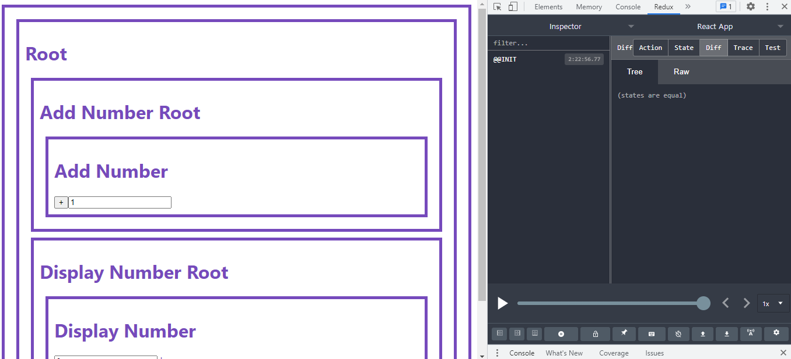

# Redux


위의 사진에서 보다시피, redux 없이 상태 관리를 할 때,
상태를 전달하기 위해서 연결되어 있는 컴포넌트로 전달하여야 한다.
하지만, 전달하기 위해서 많은 컴포넌트가 존재할 경우 많은 부분을 수정해야한다. 
이러한 것을 `Props drilling 문제`라고 한다.
이러한 점을 보완하기 위해 등장한 것이 `redux`이다. 그럼 redux를 사용해보자.

## redux 설치
`yum install redux`

## Store
Store은 state를 관리하는 전용 장소이다. state들이 store에 객체형식으로 저장된다.
```json
{
  // 세션과 관련된 것
  session: {
      loggedIn: true,
      user: {
          id: "114514",
          screenName: "@mpyw",
      },
  },
​
  // 표시중인 타임라인에 관련된 것
  timeline: {
      type: "home",
      statuses: [
          {id: 1, screenName: "@mpyw", text: "hello"},
          {id: 2, screenName: "@mpyw", text: "bye"},
      ],
  },
​
  // 알림과 관련된 것
  notification: [],
}
```
### store의 예
```javaScript
import {createStore} from 'redux';

export default createStore(function(state, action){
    if(state === undefined){
        return {number:0}
    }
    if(action.type === 'INCREMENT'){
        return {...state, number:state.number + action.size}
    }
    return state;
}, window.__REDUX_DEVTOOLS_EXTENSION__ && window.__REDUX_DEVTOOLS_EXTENSION__())
```
### Action
Action은 상태 변경을 일으키는 이벤트에 대한 정정인 정보로 이전 state를 참고해서 새로운 state를 만들기 때문에 `Action`으로 구분할 수 있도록 액션의 이름(타입)과 데이터를 가진 객체형식이다.
```json
{
  type: [액션의 종류를 식별할 수 있는 문자열 혹은 심볼],
  [액션의 실행에 필요한 임의의 데이터],
}
```
### Redux DevTools
* 참고 : [Redux DevTools](https://github.com/zalmoxisus/redux-devtools-extension)    
- createStore 매개변수로 `window.__REDUX_DEVTOOLS_EXTENSION__ && window.__REDUX_DEVTOOLS_EXTENSION__())` 값을 넣어준다. 
- [from Chrome Web Store](https://chrome.google.com/webstore/detail/redux-devtools/lmhkpmbekcpmknklioeibfkpmmfibljd) 설치한다.

- 위의 사진처럼 redux의 상태를 디버깅할 수 있다.

## redux에 종속된 기능 제거 및 독립적으로 만들기
src/component 폴더에 있는 컴포넌트이다.
```javaScript
import React, {Component} from 'react';
export default class AddNumber extends Component {
  state = {size:1}
  render() {
    return (
      <div>
        <h1>Add Number</h1>
        <input type="button" value="+" onClick={function(){
          this.props.onClick(this.state.size);
        }.bind(this)}></input>
        <input type="text" value={this.state.size} onChange={function(e){
          this.setState({size:Number(e.target.value)});
        }.bind(this)}></input>
      </div>
    )
  }
}
```
/src/containers 폴더에 있는 파일이다. src/components에 있는 `AddNumber` 컴포넌트를 return하고 상태를 전달하는 onClick 함수에 `dispatch` 함수를 사용하여 store에 상태를 전달한다.   
```javaScript
import React, { Component } from "react";
import store from '../store';
export default class extends Component{
  render(){
      return <AddNumber onClick={function(size){
          store.dispatch({type:'INCREMENT', size:size});
      }.bind(this)}></AddNumber>
  }
}
```
AddNumber의 상위 컴포넌트(AddNumberRoot)에서 import 경로는 `../containers/AddNumber` 로 설정한다.
```javaScript
import React, {Component} from "react";
import AddNumber from "../containers/AddNumber";
export default class AddNumberRoot extends Component{
  render(){
    return (
      <div>
        <h1>Add Number Root</h1>
        <AddNumber></AddNumber>
      </div>
    )
  }
}
```
전달되는 상태값을 받는 DisplayNumber 컴포넌트에서 독립적으로 store 기능을 만들기 위해
src/containers 폴더에 따로 구성한다. 전달되는 상태값을 받을 때, `subscribe` 함수에서 
`store.getState()` 함수를 사용하여 상태값을 전달받는다.
```javaScript
import React, { Component } from 'react';
import store from "../store";
export default class extends Component{
    state = {number:store.getState().number}
    constructor(props){
        super(props);
        store.subscribe(function(){
            this.setState({number:store.getState().number});
        }.bind(this));
    }
    render(){
        return <DisplayNumber number={this.state.number} unit={this.props.unit}></DisplayNumber>
    }
}
```
DisplayNumber 상위 컴포넌트(DisplayNumberRoot)에서 import 경로는 `../containers/DisplayNumber` 로 설정한다.
```javaScript
import React, {Component} from "react";
import DisplayNumber from "../containers/DisplayNumber";

export default class DisplayNumberRoot extends Component{
  render(){
    return (
      <div>
        <h1>Display Number Root</h1>
        <DisplayNumber unit="kg"></DisplayNumber>
      </div>
    )
  }
}
```

# React-Redux

## react-redux 설치
`yum install react-redux`

## React-Redux 셋팅
최상위 컴포넌트(index.js)에 Provider를 공급해준다. store는 기존에 만들어뒀던 store를 사용한다.
```javaScript
import React from 'react';
import ReactDOM from 'react-dom';
import './index.css';
import App from './App';
import reportWebVitals from './reportWebVitals';
import {Provider} from 'react-redux';
import store from './store';

ReactDOM.render(<React.StrictMode>
    <Provider store={store}>
      <App />
    </Provider>
  </React.StrictMode>,
  document.getElementById('root')
);
```

## react-redux connect() 함수 이해
참고 : [react-redux connect](https://gist.github.com/gaearon/1d19088790e70ac32ea636c025ba424e) 
connect 함수의 return 값은 함수를 return 해준다. store 저장소에 상태값을 저장하는 컴포넌트를 사용하도록 되어있고(WrappedComponent)
wrappedComponent는 Counter로 받는다. 예시) `connect(mapStateToProps)(DisplayNumber);`   
wrappedComponent의 props들이 전달된다. 그리고 mapStateToProps와 mapDispatchToProps를 매개변수로 받는다.   
`mapStateToProps` 는 store.getState() 함수를 사용한 것처럼, store에 저장되어있는 상태값들을 가져오는 함수이다.     
`mapDispatchToProps` 는 dispatch() 내부에서 호출하는 새 함수를 반환하고 일반 작업 개체를 직접 전달하거나 작업 생성자의 결과를 전달하여 사용한다.
```javaScript
// connect() is a function that injects Redux-related props into your component.
// You can inject data and callbacks that change that data by dispatching actions.
function connect(mapStateToProps, mapDispatchToProps) {
  // It lets us inject component as the last step so people can use it as a decorator.
  // Generally you don't need to worry about it.
  return function (WrappedComponent) {
    // It returns a component
    return class extends React.Component {
      render() {
        return (
          // that renders your component
          <WrappedComponent
            {/* with its props  */}
            {...this.props}
            {/* and additional props calculated from Redux store */}
            {...mapStateToProps(store.getState(), this.props)}
            {...mapDispatchToProps(store.dispatch, this.props)}
          />
        )
      }
      
      componentDidMount() {
        // it remembers to subscribe to the store so it doesn't miss updates
        this.unsubscribe = store.subscribe(this.handleChange.bind(this))
      }
      
      componentWillUnmount() {
        // and unsubscribe later
        this.unsubscribe()
      }
    
      handleChange() {
        // and whenever the store state changes, it re-renders.
        this.forceUpdate()
      }
    }
  }
}

// This is not the real implementation but a mental model.
// It skips the question of where we get the "store" from (answer: <Provider> puts it in React context)
// and it skips any performance optimizations (real connect() makes sure we don't re-render in vain).

// The purpose of connect() is that you don't have to think about
// subscribing to the store or perf optimizations yourself, and
// instead you can specify how to get props based on Redux store state:

const ConnectedCounter = connect(
  // Given Redux state, return props
  state => ({
    value: state.counter,
  }),
  // Given Redux dispatch, return callback props
  dispatch => ({
    onIncrement() {
      dispatch({ type: 'INCREMENT' })
    }
  })
)(Counter)
```
`mapDispatchToProps` : AddNumber 컴포넌트에서 onClick된 함수를 dispatch하여 store 저장소로 보낸다.
```javaScript
import AddNumber from "../components/AddNumber";
import {connect} from 'react-redux';
function mapDispatchToProps(dispatch){
    return {
        onClick:function(size){
            dispatch({type:'INCREMENT', size:size});
        }
    }
}
export default connect(null, mapDispatchToProps)(AddNumber);
```
`mapStateToProps` : dispatch() 후 store에서 처리된 state를 DisplayNumber 컴포넌트에서 props로 받는다. 
```javaScript
import DisplayNumber from '../components/DisplayNumber';
import {connect} from 'react-redux';
function mapStateToProps(state){
    return {
        number:state.number
    }
}

export default connect(mapStateToProps)(DisplayNumber);
```


## 출처
* https://opentutorials.org/module/4518
* https://c17an.netlify.app/blog/React/redux-%EC%82%AC%EC%9A%A9%ED%95%98%EA%B8%B0/article/
* https://libertegrace.tistory.com/entry/25-Redux-Redux%EC%9D%98-%EC%9E%91%EB%8F%99%EB%B0%A9%EC%8B%9D
